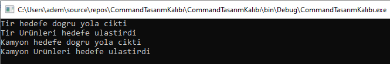

== Command Pattern

* Komut tasarımı bir komutun çalışması için gerekmektedir. Bu tasarım kalıbını kullanmayıp komutu direk çağırmış olsaydık bağımlılığı arttıracaktı. Bu yüzden command kullanıyoruz. Bazı işlem komutlarını yerine getirmek için bu tasarım kalıbını kullandık. Bizde komut olarak IslemYap metodunu yazdık. Otonom bir tır ve kamyonun yükü alıp yola çıkmasını ve hedefte durması komutlarını verdik.

.Builder Pattern Example
[uml,file="command_design.png"]
--

left to right direction

interface AracYapılacaklar{
    + void YolaCik()
    + void HedefteDur()
}

interface Command{
    + void IslemYap()
} 

class Tır{

}

class Kamyon{

}

class TırYolaCikCommand{
    + TırYolaCikCommand(Tır tir)
}

class TırHedefteDurCommand{
    + TırHedefteDurCommand(Tır tir)
}

class KamyonYolaCikCommand{
    + KamyonYolaCikCommand(Kamyon kamyon)
}

class KamyonHedefteDurCommand{
    + KamyonHedefteDurCommand(Kamyon kamyon)
}

class UzaktanAracKontrol{
    + void setCommand(Command command)
    + void islemSec()
}

Tır ..|> AracYapılacaklar
Kamyon ..|> AracYapılacaklar

TırYolaCikCommand ..|> Command
TırHedefteDurCommand ..|> Command
KamyonYolaCikCommand ..|> Command
KamyonHedefteDurCommand ..|> Command

KamyonYolaCikCommand --> Kamyon
KamyonHedefteDurCommand --> Kamyon

TırYolaCikCommand --> Tır
TırHedefteDurCommand --> Tır

UzaktanAracKontrol --> Command

--

[source,C#]
----
public interface Command
{
    void IslemYap() <1>
}

public interface AracYapılacaklar
{
    void YolaCik() <2>
    void HedefteDur() <3>
}

class UzaktanAracKontrol
{
    Command command <4>

    public void setCommand(Command command) <5>
    
    public void islemSec() <6>
    
}

----
<1> Verilecek komutların çalıştırılacağı metod
<2> Aracın yola çıkma metodu
<3> Aracın hedefe ulaştığında çalışacak metod
<4> Command değişkeni
<5> Command değişkeni ataması
<6> Command yapılacak işlem seçimi

--
* Çıktıdan anlaşıldığı üzere Tır ve Kamyon hedefe doğru yola çıkıp, hedefe ulaşmıştır.

--

