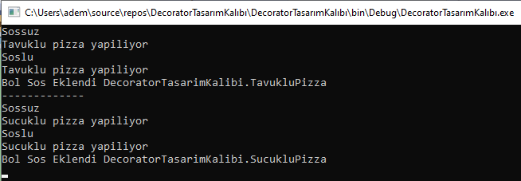

== Decorator Pattern

* Decorator deseni structural desenlerden biridir. Yeni bir özellik eklemek istediğimiz durumlarda kullanılabilir.
Kalıtım yapmadan yeni bir özellik eklemek istediğimiz durumlarda kullanılabilir. Örnek senaryomda Sucuklu ve Tavuklu Pizzaya yeni özellik eklemek istediğimde yeni class oluşturum kalıtım almak yerine bunlara özellik eklemek için yeni method oluşturdum. Böylelikle decorator desenine uymuş oldum

.Builder Pattern Example
[uml,file="decorator_design.png"]
--

left to right direction

abstract class Pizza{
    + {abstract} void pizzaYap()
}

class SucukluPizza{

}

class TavukluPizza{

}

abstract class PizzaDecorator {
    # Pizza pizzaDecorator 
    + PizzaDecorator(Pizza pizzaDecorator)
    
}

class SosluPizzaDecorator{
    + SosluPizzaDecorator(Pizza pizzaDecorato)
    - void bolSosEkle(Pizza pizzaDecorator)
}

SosluPizzaDecorator ..|> PizzaDecorator
PizzaDecorator ..|> Pizza
TavukluPizza ..|> Pizza
SucukluPizza ..|> Pizza 

--

[source,C#]
----
abstract class PizzaDecorator : Pizza
{
    public override void pizzaYap()
    {
        pizzaDecorator.pizzaYap() <1> 
    }
}

class SosluPizzaDecorator : PizzaDecorator
{
    public SosluPizzaDecorator(Pizza pizzaDecorato) : base(pizzaDecorato)
    {
    }

    public override void pizzaYap()
    {
        pizzaDecorator.pizzaYap()
        bolSosEkle(pizzaDecorator) <2>
    }

}

----
<1> Mevcut özellik
<2> Dekorator'de yeni özellik ekleme

* Çıktıdan anlaşılacağı üzere ilk başta Tavuklu Pizza yapılmıştır ardın sos eklenerek tavuklu pizza yapılmıştır.
Sucuklu pizza için de durum aynı şekilde olmuştur.
